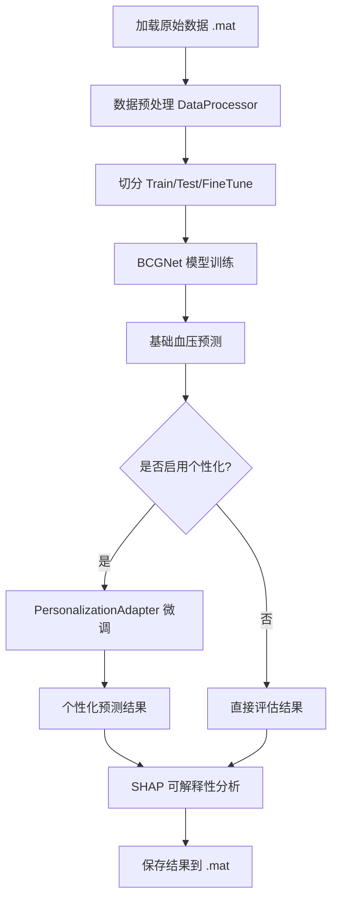
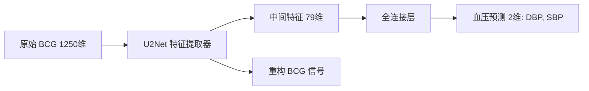
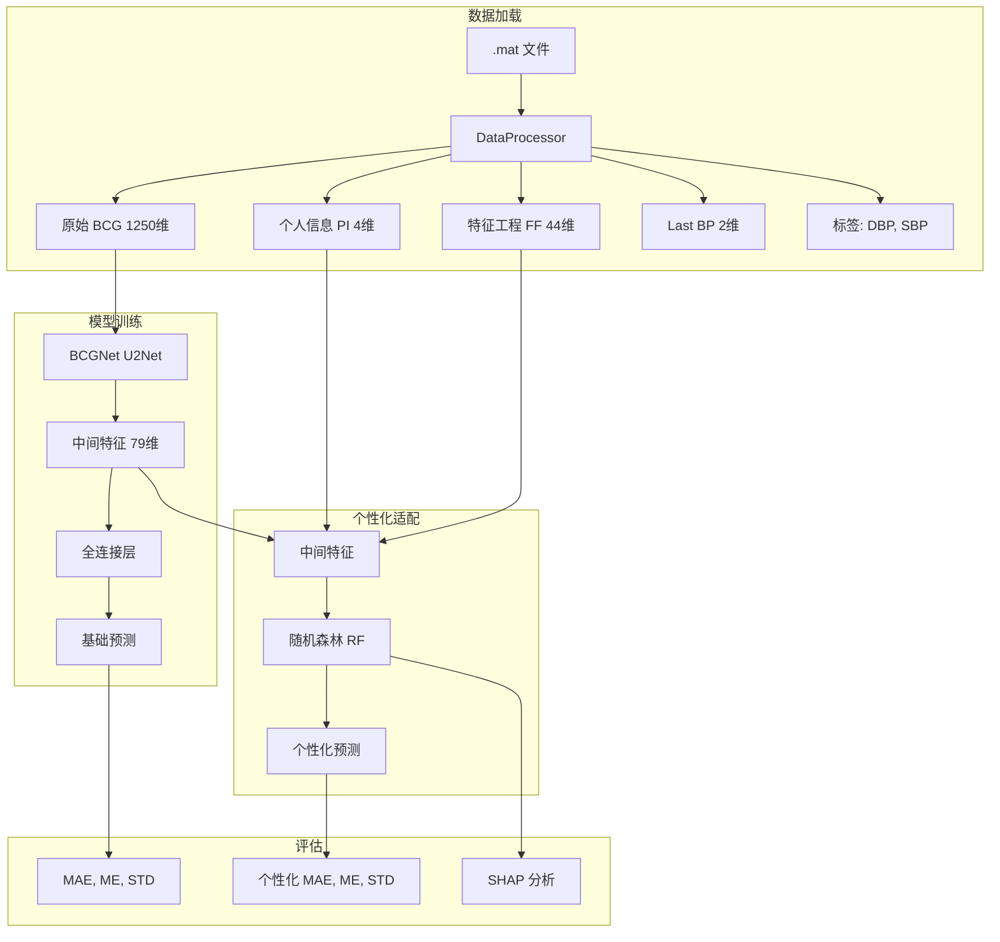

# BCG2BP 项目架构分析

## 📋 项目概述

这是一个基于深度学习的 **BCG（心冲击图）信号到血压（BP）转换** 项目，主要目标是通过机器学习模型从 BCG 信号预测收缩压（SBP）和舒张压（DBP），并提供个性化适配功能。

---

## 🎯 核心功能

1. **BCG 信号特征提取**：使用深度学习模型从原始 BCG 信号中提取特征
2. **血压预测**：将提取的特征映射到血压值（SBP 和 DBP）
3. **个性化适配（PA）**：针对特定用户微调模型以提高预测精度
4. **可解释性分析**：使用 SHAP 值分析特征重要性

---

## 🏗️ 项目架构

### 整体流程图



---

## 📁 核心模块详解

### 1️⃣ 主程序：[main.py](file:///d:/zsy/坐垫/2024_AIdriven/BCG2BP-main/main.py)

**职责**：协调整个训练和测试流程

#### 关键步骤

1. **参数配置**（第 21-75 行）
   - 使用 `argparse` 解析命令行参数
   - 定义训练方案（`training_scheme`）、数据路径、训练参数等
   - 核心参数：
     ```python
     params = {
         'is_finetune': 1,          # 是否启用个性化
         'PA_model': 'RF',          # 个性化适配器模型（随机森林）
         'use_BCG': True,           # 使用 BCG 特征
         'use_PI': True,            # 使用个人信息特征
         'use_FF': True,            # 使用特征工程特征
         'finetune_N': 10,           # 微调数据量
     }
     ```

2. **数据加载**（第 92-94 行）
   ```python
   data_processor = DataProcessor(datapath, signal_type, training_scheme, params)
   data_processor.load_data()
   train_loaders, test_loaders, fine_tune_loaders = data_processor.get_loaders()
   ```

3. **交叉验证训练**（第 100-152 行）
   - 对每个 fold 进行训练和测试
   - 如果是训练模式，训练 BCGNet 模型
   - 否则，加载已保存的模型
   - 进行基础预测和评估

4. **个性化适配**（第 140-149 行）
   - 如果 `is_finetune=1`，为每个用户训练个性化适配器
   - 使用随机森林（RF）或 MLP 模型
   - 保存个性化结果

5. **可解释性分析**（第 154-192 行）
   - 使用 SHAP 值分析特征重要性
   - 可视化收缩压和舒张压的 Top 12 重要特征

---

### 2️⃣ 数据预处理：[data_preprocessing2.py](file:///d:/zsy/坐垫/2024_AIdriven/BCG2BP-main/util/data_preprocessing2.py)

**职责**：加载、预处理和切分数据

#### 核心类：`DataProcessor`

**关键方法**：

1. **`load_data()`**（第 58-100 行）
   - 从 `.mat` 文件加载数据
   - 调用 `_load_subjects_data()` 提取每个受试者的数据
   - 根据 `training_scheme` 切分数据（如 NDL、DL、SM 等）

2. **`_load_subjects_data()`**（第 167-271 行）
   - 提取每个受试者的原始 BCG 信号、血压标签、个人信息（PI）和特征工程特征（FF）
   - 数据结构：
     - **BCG 信号**：1250 维原始信号
     - **个人信息（PI）**：性别、年龄、身高、体重（4 维）
     - **特征工程特征（FF）**：基于 BCG 信号的手工特征（44 维）
     - **Last BP**：上一次测量的血压值（2 维）
     - **标签**：DBP 和 SBP

3. **`_process_NDL()`**（第 304-379 行）
   - NDL = Non-Domain-specific Learning（非领域特定学习）
   - 这些方法负责将数据划分为训练集、测试集和微调集，用于跨用户泛化的交叉验证。

4. **`get_loaders()`**（第 558-559 行）
   - 返回训练、测试和微调的 DataLoader

---

### 3️⃣ 模型定义：[BCGNET.py](file:///d:/zsy/坐垫/2024_AIdriven/BCG2BP-main/model/BCGNET.py)

**职责**：定义深度学习模型架构

#### 模型架构



#### 核心组件

1. **`BCGNet` 类**（第 96-149 行）
   - **输入**：
     - `raw_bcg`：原始 BCG 信号（1250 维）
     - `covar`：协变量（PI + FF，48 维）
   - **特征提取器**：使用 `U2Net` 提取 BCG 特征
   - **预测头**：全连接层输出 DBP 和 SBP

2. **`U2Net`**（第 10 行导入）
   - U-Net 风格的编码器-解码器架构
   - 用于 BCG 信号的特征提取和重构

3. **输出**：
   - `out`：血压预测值（2 维）
   - `mid_feature`：中间特征（79 维）
   - `recon_bcg`：重构的 BCG 信号（用于辅助训练）

---

### 4️⃣ 模型训练：[training.py](file:///d:/zsy/坐垫/2024_AIdriven/BCG2BP-main/util/training.py)

**职责**：定义训练循环和损失函数

#### 核心函数：`train_DL()`

**训练流程**（第 32-132 行）：

1. **损失函数**：
   - **回归损失**：Huber Loss（对异常值更鲁棒）
   - **重构损失**：MSE Loss（重构 BCG 信号）

2. **优化器**：Adam 优化器

3. **训练循环**：
   - 对每个 epoch 遍历训练数据
   - 计算总损失 = 回归损失 + 重构损失
   - 反向传播更新参数
   - 在验证集上评估，保存最佳模型

---

### 5️⃣ 个性化适配器：[PersonalizationAdapter.py](file:///d:/zsy/坐垫/2024_AIdriven/BCG2BP-main/PersonalizationAdapter.py)

**职责**：为每个用户微调模型以提高个性化预测精度

#### 核心函数：`training_PA()`

**个性化流程**（第 245-407 行）：

1. **提取特征**（第 277-279 行）
   - 使用已训练的 BCGNet 提取中间特征（79 维）
   - 结合协变量（PI + FF）

2. **构建微调数据**（第 285-311 行）
   - 为每个用户准备少量微调样本（`finetune_N`）
   - 可选：加入相似人群的数据增强

3. **训练随机森林回归器**（第 334-347 行）
   - 使用微调数据训练随机森林模型
   - 选择特征：BCG 特征 + PI + FF

4. **预测和评估**（第 386-405 行）
   - 在测试集上使用个性化模型预测
   - 计算 MAE、ME、STD 评估指标

5. **SHAP 可解释性**（第 351-355 行）
   - 使用 SHAP 值分析特征重要性

---

## 🔄 数据流动



---

## 🔑 关键概念

### 训练方案（Training Scheme）

- **NDL (Non-Domain-specific Learning)**：受试者不重叠的交叉验证
- **DL (Domain-specific Learning)**：传统的随机切分
- **SM**：其他特殊切分方式

### 微调策略（Finetune Strategy）

- **sequential**：按时间顺序从数据集前部取微调样本
- **startEnd**：从数据集起始和结尾各取一半微调样本

### 特征类型

1. **BCG 特征**：深度学习模型提取的 79 维中间特征
2. **PI (Personal Information)**：性别、年龄、身高、体重
3. **FF (Fiducial Features)**：基于 BCG 信号波形的手工特征（如峰值间隔、振幅等）

---

## 📊 评估指标

- **MAE (Mean Absolute Error)**：平均绝对误差
- **ME (Mean Error)**：平均误差（评估系统性偏差）
- **STD (Standard Deviation)**：标准差

均分别计算 DBP 和 SBP 的指标。

---

## 🛠️ 使用流程

### 训练模式

```bash
python main.py --training --epoch 20 --lr 0.0005
```

### 测试模式（加载已有模型）

```bash
python main.py
```

---

## 💡 项目亮点

1. ✅ **端到端学习**：从原始 BCG 信号直接预测血压
2. ✅ **个性化适配**：针对每个用户微调以提高精度
3. ✅ **可解释性**：使用 SHAP 分析特征重要性
4. ✅ **多特征融合**：结合深度学习特征、个人信息和手工特征
5. ✅ **重构辅助训练**：通过重构任务提高特征提取质量

---

## 📝 总结

这个项目采用了 **"基础模型 + 个性化适配"** 的两阶段策略：

1. **阶段一**：训练通用的 BCGNet 模型，从 BCG 信号中提取通用特征并预测血压
2. **阶段二**：对每个用户使用少量数据训练个性化适配器（随机森林），提高预测精度

这种设计既保证了模型的泛化能力，又能适应个体差异，是典型的 **Transfer Learning + Personalization** 范式。
